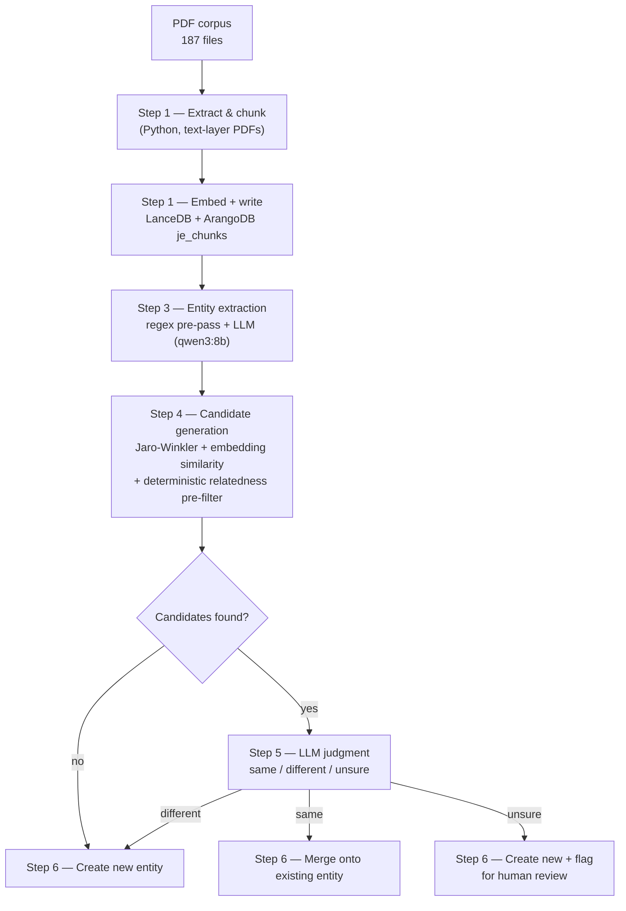

# Graph RAG over Real Court Filings

An end-to-end Graph RAG (Retrieval-Augmented Generation) pipeline that turns a corpus of 187 real, publicly available federal court filings (SDNY docket 447706, ~4,000 pages) into a queryable knowledge graph — entities, relationships, and provenance — backed by a graph database and a vector store, running entirely on local models.

Built as a from-scratch systems project: PDF ingestion, chunking, embedding, LLM-based entity extraction, and a multi-stage deduplication pipeline that resolves the same real-world person or organization across thousands of differently-phrased mentions, without silently merging two different people into one.

## Why local models, not a cloud API

The source documents are unsealed but sensitive federal litigation records — names of alleged victims, witnesses, and other private individuals appear throughout. Every extraction and judgment call in this pipeline runs against a local model (Ollama), not a third-party API. That constraint shaped real design decisions, not just a config flag — see [Security Considerations](./_security_considerations_RAG_LLMs.md) for the fuller enterprise-hardening writeup (identity/ACL propagation, RLS, injection guardrails) this project is scoped against but deliberately doesn't implement, being single-user by design.

## Architecture



Two databases, each doing the job it's actually good at: **ArangoDB** holds the graph (entities, mention edges, possible-duplicate flags); **LanceDB** holds the vectors (chunk embeddings, per-mention context embeddings for dedup). Node.js drives orchestration and I/O; Python handles PDF text extraction, where its libraries are stronger.

## The pipeline

1. **Intake** (deterministic) — extract text, chunk (~1000 words, overlapping), embed, write to both stores.
2. **Entity extraction** (regex + LLM) — a deterministic pre-pass pulls docket numbers and dates directly out of the text (no reason to spend an LLM call on something a regex nails exactly); an LLM call (schema-constrained JSON output) extracts person/organization/court entities, with an explicit `reference` type used to discard citations to other cases rather than let them pollute the graph.
3. **Candidate generation** (deterministic, no LLM) — for each newly-extracted entity, two independent channels find a short list of existing entities it might already be: string similarity on the name (Jaro-Winkler), and embedding similarity over the *surrounding context* of the mention, not the bare name — this is what lets a vague later reference like "defense counsel" get connected back to an explicitly-named attorney from an earlier chunk, purely from overlapping role/case-number language.
4. **LLM judgment** — given the current mention and each candidate's known facts, the model decides same / different / genuinely unsure per candidate. A false merge (collapsing two different real people into one node) is treated as strictly worse than a missed merge, so "unsure" never silently resolves to a merge — it's written as a flagged possible-duplicate edge for a human to review later.
5. **Merge / write** (deterministic) — confirmed match upserts onto the existing node; no match creates a new one; ambiguous creates a new one *and* the review flag.

Repeat across all 187 documents, all chunks.

## Engineering problems actually solved here (not just wired together)

- **Noise in the embedding-similarity channel.** Real-data testing showed the embedding channel nominating things like two frequently-co-occurring, entirely unrelated names as dedup candidates purely because they constantly appear in the same dense sentences — zero name-level connection. Every one of those burned an LLM call and came back "unsure," flooding the review queue. Fixed with a deterministic pre-filter (shared-token / acronym-relatedness check) that runs before a candidate ever reaches the LLM, while deliberately *not* filtering the legitimate low-string-similarity case (a role-phrase like "defense counsel" matching a named person) that the embedding channel exists to catch in the first place.
- **Bounded concurrency vs. correctness.** Sequential processing made the dedup pass ~31s/chunk — multi-day for the full backlog. Parallelizing reopens a real race: two entities resolved concurrently can each miss the other and create duplicate nodes. Chose to accept the race (parallelize for ~2x throughput, clean up duplicates in a separate pass afterward) over correctness-under-concurrency locking — and then confirmed the race actually happens, at a real, low, predictable rate, by tracing duplicate-entity pairs back to the exact adjacent chunks a bounded worker pool would process simultaneously.
- **Guarding against LLM overreach on ambiguous evidence.** A deterministic backstop downgrades an LLM "same entity" verdict to "unsure" when it rests on embedding similarity alone with no name-level corroboration and neither name is a generic role-phrase — catching a real observed failure mode (the model conflating two different people who happened to appear in the same dense list sentence) that prompt wording alone didn't prevent.

## Status

Ingestion (Step 1) and entity extraction (Step 3) are complete across the full corpus. The dedup pipeline (Steps 4-6) is validated and, as of this writing, mid-run against the full backlog. Query-time RAG (retrieval + cited answer composition) is the next phase, not yet built.

## Getting the source corpus

The 187 source PDFs aren't in this repo (a downloaded public-records corpus isn't this project's own IP, and it's too large to be worth bloating repo history with). They're available as a [GitHub Release](../../releases) asset instead.

## Running it

Requires: Node.js 20+, Python 3, an ArangoDB instance, and [Ollama](https://ollama.com) running locally with `qwen3:8b` and `bge-large` pulled.

```bash
# ArangoDB (example — set your own root password)
docker run -d -p 8529:8529 -e ARANGO_ROOT_PASSWORD=<your-password> --name arangodb-instance arangodb

cd node
npm install
cp .env.example .env   # fill in your ArangoDB connection details
npm run run-extraction # Step 3 batch run (resumable)
npm run run-dedup      # Steps 4-6 batch run (resumable, bounded concurrency)
```

## Stack

Node.js, Python, ArangoDB (graph), LanceDB (vector), Ollama (local LLM + embeddings — `qwen3:8b`, `bge-large`), Express.
